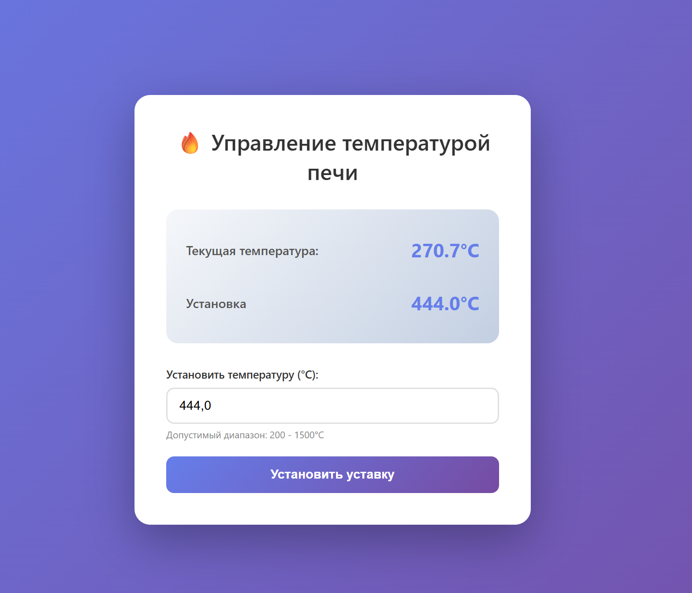
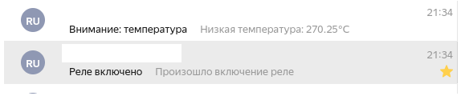
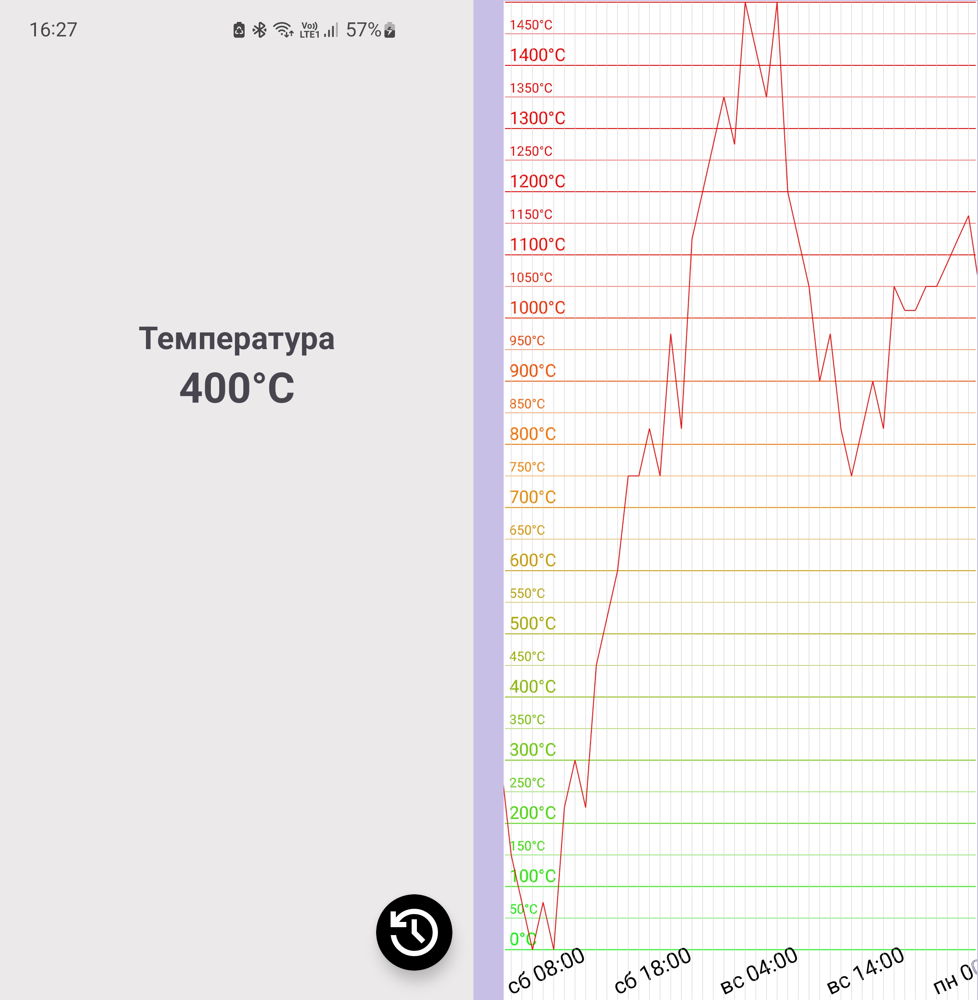

# Авторы:
  РЕМЯННИКОВ ВАЛЕНТИН ВЛАДИМИРОВИЧ
  
  КОТОВ АЛЕКСЕЙ ВАЛЕРЬЕВИЧ
# Приложение Android для задания и мониторинга температуры печи
 # Оглавление

- [Описание проекта](#Описание-проекта)
  - [1. Для чего](#1-для-чего)
  - [2. Пример работы](#2-примеры-работы)
- [Технологии](#Технологии)
- [Возможности для развития](#Возможности-для-развития)

# Описание проекта
### 1. Для чего: 
Приложение Android для задания и мониторинга температуры печи. Оно помогает пользователю контролировать процесс нагрева и анализировать данные за прошедшие периоды.

##### Главный экран (MainActivity):
  - Отображает текущую температуру печи, для обновления нужно потянуть вниз.

##### Экран истории (TemperatureGraphActivity):

  - Показывает историю температуры за последние часы/дни.

  - Данные хранятся в формате JSON, где каждое значение температуры записывается один раз в час.

  - История отображается в виде графика для наглядности.
  - График масштабируется от одного часа (`"EEE HH:mm"`) до дня (`"MM.dd"`).
### 2. Примеры работы:
После установки температура в 444 градуса приходит уведомление на почту о включении реле.

Так же приходит уведомление на почту, информирующее о слишком низкой текущей температура по сравнению с заданной.

#### Андроид приложеине 

# Технологии
- **Язык программирования**: Kotlin

### Основные библиотеки:
- **[Lottie](https://airbnb.io/lottie/)** (`com.airbnb.android:lottie:6.1.0`) — для отображения анимаций в формате JSON.
- **[Retrofit](https://square.github.io/retrofit/)** (`com.squareup.retrofit2:retrofit:2.9.0`) — для выполнения сетевых запросов.
- **[Retrofit Gson Converter](https://square.github.io/retrofit/)** (`com.squareup.retrofit2:converter-gson:2.9.0`) — для преобразования JSON-ответов в объекты Kotlin/Java.
- **[OkHttp](https://square.github.io/okhttp/)** (`com.squareup.okhttp3:okhttp:4.9.3`) — HTTP-клиент для работы с сетевыми запросами.
- **[OkHttp Logging Interceptor](https://square.github.io/okhttp/)** (`com.squareup.okhttp3:logging-interceptor:4.9.3`) — для логирования сетевых запросов и ответов.
- **[Gson](https://github.com/google/gson)** (`com.google.code.gson:gson:2.10.1`) — для сериализации и десериализации JSON.

### UI
- **[Jetpack Compose Material 3](https://developer.android.com/jetpack/compose)** (`androidx.compose.material3:material3:1.1.1`) — для создания UI с использованием Material Design 3.
- **[Material Components](https://material.io/develop/android)** (`com.google.android.material:material:1.9.0`) — для использования Material Design компонентов.

### Графики
- **[Canvas](https://developer.android.com/jetpack/compose/graphics)** — для кастомной отрисовки графиков и элементов интерфейса. Используется для создания интерактивного графика температуры с поддержкой масштабирования и жестов.

# Возможности для развития

Проект можно улучшить, добавив следующие функции и улучшения:

### 1. Push-уведомления в Android-приложении
   - Реализация системы push-уведомлений для информирования пользователей о важных событиях.
   - Интеграция с Firebase Cloud Messaging (FCM) для отправки уведомлений.

### 2. Масштабирование системы
   - Поддержка нескольких печей для одновременного мониторинга.

### 3. Улучшение интерфейса
   - Поддержка темной темы для улучшения пользовательского опыта.

### 4. Экспорт данных
   - Возможность экспорта истории температуры в форматы CSV или Excel для дальнейшего анализа.
